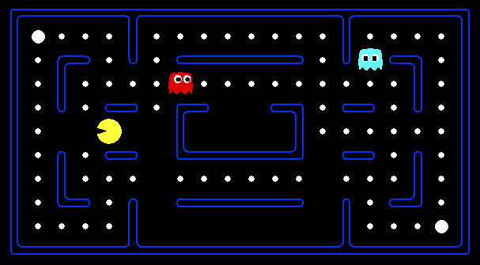

# 2018Fall-Artificial-Intelligence
home works and final project for 2018 Fall -"Introduction to Artificial Intelligence and Machine Learning"

## Home Work

From hw1 ~ hw4 are pacman game, which require implementation of some Artificial Intelligence concepts. Their topic are below:

* hw1 -- **Search** 
* hw2 -- **Multiagent** 
* hw3 -- **Inference**
* hw4 -- **Reinforcement learning**

For each homework, there's a Project_.html under their folder, please open it in browser to see more details, descriptions for each problem.

> All these homework is refernced from UC Berkely's AI course. [link](http://ai.berkeley.edu/project_overview.html)

## Final Project

This project requires implementatoin of stategies in the "Break Bricks" game. The agent have to play automatically according to the strategy and the information perceived in the game. More details are in Final Project/slide.pdf
